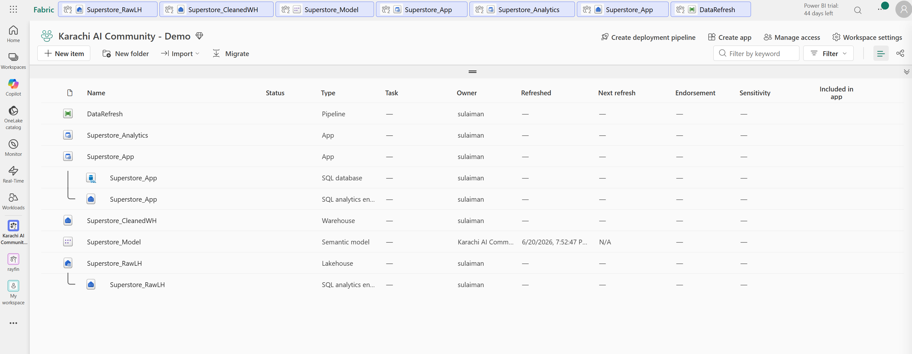
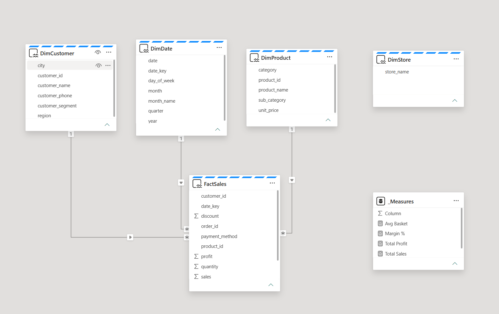
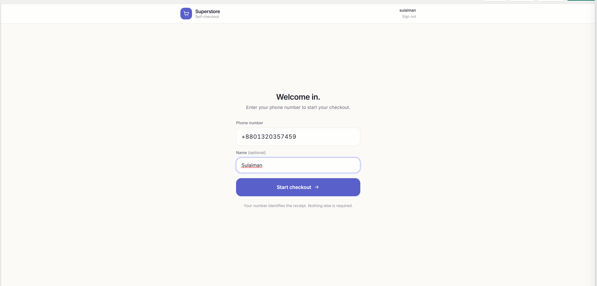
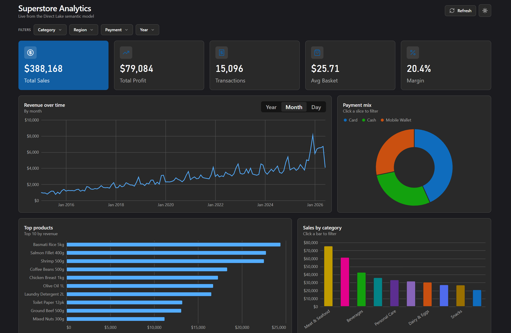
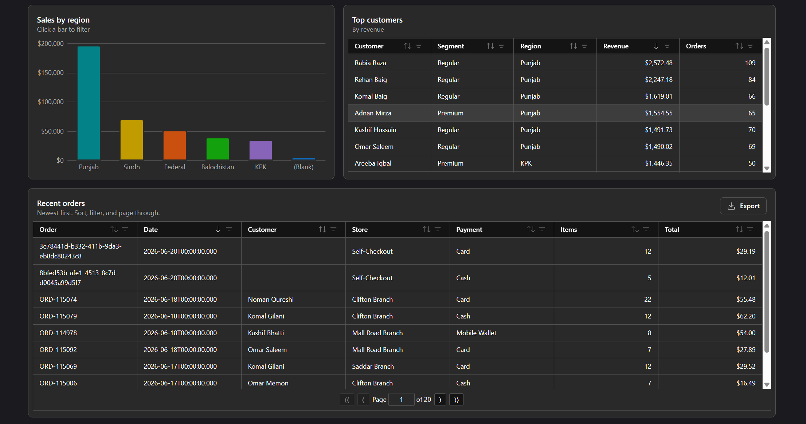
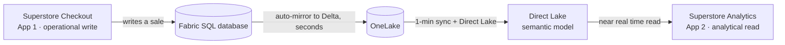

# 🛒 Superstore Fabric App

**Is this the end of Power BI? No. It evolved.** Two real apps on Microsoft Fabric that share one source of truth: an operational self-checkout that **writes** sales, and an analytics dashboard that **reads** them back **near real time**.


This is the full, working build from the Karachi AI Community session **"End of Power BI? Introduction to MS Fabric Apps with Rayfin"** (21 June 2026). It answers a question a lot of analysts are quietly asking, by building rather than talking.

Power BI is not going away. The semantic model is still the source of truth. What is new is the **app** built around it. To show that, this repo holds **two apps on Microsoft Fabric**, sharing one governed source of truth:

1. an **operational** self-checkout that writes sales, and
2. an **analytics** dashboard that reads them back near real time.

The part that makes a room lean in: there is no nightly ETL between them. A sale rung up in App 1 shows up, named, in App 2 about a minute later. That is a **translytical** application, and it is where analytics is heading: from dashboards to data apps.

---

## 📸 What it looks like

| One workspace, both apps and the model | The Direct Lake semantic model |
| :---: | :---: |
|  |  |

| App 1 · Self-checkout (operational write) | App 2 · Sales Analytics (analytical read) |
| :---: | :---: |
|  |  |

**The payoff, proven live:** ring up a sale in the checkout app, and about a minute later it appears in the analytics app, with the shopper's name, ready to drill into.



---

## 🧠 How it works: the translytical loop



1. **Write.** A shopper checks out in App 1. The sale is written to a **Fabric SQL database** through Rayfin's generated GraphQL API.
2. **Mirror.** A Fabric SQL database **auto-mirrors itself into OneLake** as Delta Parquet, in seconds, with zero setup.
3. **Unify.** A thin data workflow (a OneLake shortcut plus a one-minute pipeline) folds those operational writes into the gold star schema.
4. **Model.** A **Direct Lake** semantic model reads the star schema straight from OneLake. No import refresh.
5. **Read.** App 2 queries that model **as the signed-in user** and renders the dashboard. The new sale is already there.

Two apps. One source of truth. Reports show, apps act.

---

## 🗂 Repository structure

```
Superstore_FabricApp/
├── apps/
│   ├── superstore-checkout/    # App 1 · operational write (Rayfin blankapp)
│   └── superstore-analytics/   # App 2 · analytical read  (Rayfin dataapp)
├── docs/                       # The full rebuild recipe (start at docs/README.md, then 01 to 07)
├── data/
│   └── superstore_sales_flat.csv   # Synthetic seed data, 2015 to 2026 YTD
├── slides/
│   └── End-of-PowerBI-Fabric-Apps-Rayfin.pdf   # The talk deck
└── assets/                     # Screenshots used in this README
```

---

## 🧩 The two apps

| | **App 1 · Superstore Checkout** | **App 2 · Superstore Analytics** |
| --- | --- | --- |
| **Role** | Operational, the write side | Analytical, the read side |
| **What it does** | Phone gate, searchable catalog, cart with live totals, payment, receipt | KPIs, revenue trend with Year/Month/Day drill, charts, two tables, click to filter, dark mode, and a customer/order **drill-through** |
| **Data path** | Writes `Sale` + `SaleLine` to a Fabric SQL database | Reads a Direct Lake semantic model via the Execute DAX Queries API |
| **Rayfin template** | `blankapp` | `dataapp` |
| **Runs** | Standalone or in the Fabric portal. Has an offline preview | Inside the Fabric portal (model-connected apps render there) |

---

## 🛠 Tech stack

- **Microsoft Fabric**: OneLake, SQL database in Fabric (auto-mirror), Warehouse, Direct Lake, Power BI semantic model.
- **Rayfin**: Microsoft's open-source SDK and CLI for Fabric Apps (public preview, from Build 2026). One command turns a TypeScript data model into a deployed backend (SQL + GraphQL + Entra auth + hosting).
- **Frontend**: React 19, Vite 7, Tailwind v4, TypeScript.
- **Analytics**: DAX over a star schema (DimDate, DimProduct, DimCustomer, DimStore, FactSales), Vega-Lite charts, a Fabric DataGrid.

---

## 🚀 Rebuild it yourself

The complete, copy-paste recipe lives in **[docs/](docs/)**. Start with **[docs/README.md](docs/README.md)**, then follow **01 to 07** in order.

**Prerequisites**
- A Fabric capacity (a free trial works) in a **supported region** (Central US works; some regions are gated).
- Tenant settings: *Fabric App Items (preview)*, *Users can create Fabric items*, and *Semantic Model Execute Queries REST API*.
- Node 20+.

**App 1, the fastest way to see it (no cloud needed):**
```bash
cd apps/superstore-checkout
npm install
npm run dev:preview     # http://localhost:5173, full UI on in-memory data
```
Deploy it to Fabric:
```bash
npx rayfin login
npx rayfin up           # provisions the SQL database + GraphQL API + Entra auth + hosting
```

**App 2 (point it at your own model):**
```bash
cd apps/superstore-analytics
npm install
# edit fabric.yaml: set workspaceId + itemId to YOUR workspace and semantic model
npx fabric-app-data generate -o src/fabric.generated.ts
npm run build
npx rayfin up
# then open the app inside the Fabric portal
```

> The 5 model measures (`Total Sales`, `Total Profit`, `Transactions`, `Avg Basket`, `Margin %`) must exist in your semantic model. The DAX for them is in **[docs/07-fabric-tsql-queries.md](docs/07-fabric-tsql-queries.md)**.

---

## 📊 The data

[`data/superstore_sales_flat.csv`](data/superstore_sales_flat.csv) is a synthetic flat sales file (orders from 2015 to 2026 YTD, customers, products, stores, payments). Load it into a Lakehouse, shape it into the star schema with the T-SQL in **[docs/07-fabric-tsql-queries.md](docs/07-fabric-tsql-queries.md)**, and build the Direct Lake model on top. No real customer data is included.

---

## 🎞 Slides

The talk deck is in **[slides/End-of-PowerBI-Fabric-Apps-Rayfin.pdf](slides/End-of-PowerBI-Fabric-Apps-Rayfin.pdf)**.

---

## ⚠️ Notes

- **Public preview.** Fabric Apps and Rayfin are in preview. APIs and behavior can change.
- **No secrets here.** All tenant ids, workspace ids, publishable keys, and deployment state were removed. `fabric.yaml` and the `.env.example` files use placeholders; plug in your own.
- **App 2 is portal-only.** A model-connected app queries as the signed-in user, so it renders inside the Fabric portal, not from a standalone link.
- **Sharing.** A deployed Fabric App is reached through Entra SSO and shared like any Fabric item (Run and interact permission), to users in your own tenant. There is no anonymous public link today.

---

## 📄 License

MIT. The two apps are scaffolded from Microsoft's open-source Rayfin templates (also MIT). Built by **Sulaiman Ahmed** for the Karachi AI Community.
